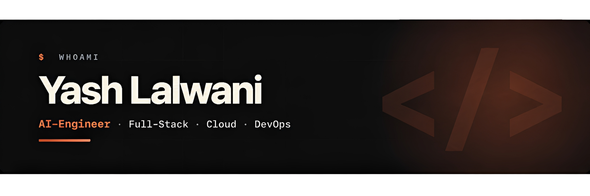

<div align="center">
  
</div>

<p align="center">
  <a href="https://yashlalwani.info"></a>
  <a href="https://www.linkedin.com/in/yashlalwani10"></a>
  <a href="mailto:yashlalwani.dev@gmail.com"></a>
</p>

<div align="center">
  
</div>

---

## 👨‍💻 About Me


- Senior pursuing a **B.S. in Computer Science** with a **Data Science minor** at **Rutgers**
- **Research Assistant – AI & Data Automation** at **Rutgers**
- **AI Extern** at **Pfizer**
- **AI Engineering** | **Software Engineering** | **Multi-Agent Systems** | **Production AI Agents**
- Explore my work at [yashlalwani.info](https://yashlalwani.info/)

**🛠 Tech Stack**<br><br>
Languages: &nbsp;
&nbsp;
&nbsp;
&nbsp;
&nbsp;
<br>
AI Engineering: &nbsp;
&nbsp;
&nbsp;
&nbsp;
&nbsp;
<br>
Frameworks: &nbsp;
&nbsp;
&nbsp;
&nbsp;
&nbsp;
&nbsp;
<br>
Databases: &nbsp;
&nbsp;
&nbsp;
&nbsp;
<br>
Tools &amp; Cloud: &nbsp;
&nbsp;
&nbsp;


<br clear="right"/>

---

## 🚀 Featured Projects

- **[Rag-Engine](https://rag.yashlalwani.info/mcp)** | Enterprise-Grade Advanced RAG System with Hybrid Search, Reranking, HyDE, CRAG, Self-RAG, Text2SQL, Caching, and Guardrails, Orchestrated with LangGraph
- **[Astra](https://astra.yashlalwani.info/)** | Production-Grade Multi-Agent Clinical Trial Intelligence System with a Three-Layer Memory Architecture, LangSmith Tracing, and AI Guardrails
- **[Plane](https://plane.yashlalwani.info/)** | Production-Style Software Platform with a Modern Backend Architecture, Role-Based Access Control (RBAC), and Secure Authentication


## `$ cat current_focus.txt`

```text
Multi-Agent AI Systems
Production AI Systems
RAG & LLM Systems
Machine Learning & Deep Learning
```

---

## 📫 Let's Connect

<p align="center">
  <a href="mailto:yashlalwani.dev@gmail.com">
    
  </a>
  <a href="https://notbyai.fyi/#not-by-ai-mission">
    
  </a>
  Always happy to connect with people building interesting things in AI and software.<br>
  do check out my projects, and feel free to reach out 🚀.
</p>
<br clear="both" />
