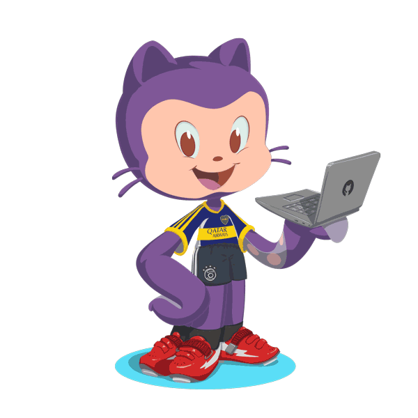

```bash
$ whoami
```

<h1 align="center">Hi, I'm <a href="https://yashlalwani.info">Yash Lalwani</a> 👋</h1>

<p align="center">
  <b>Computer Science @ Rutgers University</b> • AI/ML • Backend Engineering • Software Engineering
</p>

<p align="center">
  <a href="https://yashlalwani.info">Portfolio</a> •
  <a href="https://www.linkedin.com/in/yashlalwani10">LinkedIn</a> •
  <a href="mailto:yash.lalwani10@outlook.com">Email</a>
</p>

---

## 👨‍💻 About Me


🎓 Senior pursuing a **B.S. in Computer Science** with a **Data Science minor** at Rutgers University  
🤖 **AI/ML Research Assistant & Automation Engineer** at Rutgers University  
🧬 **AI Extern** at Pfizer  
⚙️ Interested in **Backend Engineering, Machine Learning, RAG, LLM systems, and intelligent applications**  
🚀 I like building systems that go beyond demos — APIs, automation, retrieval pipelines, ML workflows, and deployed applications  
📅 Expected graduation: **May 2027**  
🌐 Explore my work at **[yashlalwani.info](https://yashlalwani.info)**  

<br clear="right"/>

## 🛠 Tech Stack

**Languages / Scripting**

&nbsp;
&nbsp;
&nbsp;
&nbsp;
&nbsp;
&nbsp;


**AI / ML**

&nbsp;
&nbsp;
&nbsp;
&nbsp;
&nbsp;
&nbsp;


**Frameworks / Libraries**

&nbsp;
&nbsp;
&nbsp;
&nbsp;
&nbsp;
&nbsp;


**Databases / Developer Tools**

&nbsp;
&nbsp;
&nbsp;
&nbsp;
&nbsp;
&nbsp;
&nbsp;


---

## 🚀 Featured Projects


### 🤖 [MyGPT](https://github.com/Yash-Lalwani)
Full-stack AI chat application built with **React, Node.js, Express, MongoDB, and the OpenAI API**, including persistent conversational history.

### 📰 [Newsly.AI](https://newsly-ai.streamlit.app)
AI-powered news exploration platform with **sentiment analysis, visualizations, web scraping, and an assistant chatbot**.

### 📈 [Zerodha Clone](https://github.com/Yash-Lalwani)
Full-stack trading interface with **authentication, dashboard access, Chart.js visualizations, and buy/sell workflows**.

<br clear="right"/>

---

## `$ cat current_focus.txt`

```text
Backend Engineering
Machine Learning & Applied AI
RAG / LLM Applications
Agentic AI Systems
Production-Grade Software
```

---

<details>
<summary><b>⚙️ GitHub Analytics</b></summary>
<br>

<p align="center">
  
</p>

<p align="center">
  
</p>

<p align="center">
  
</p>

</details>

---

## 📫 Let's Connect

<p align="center">
  <a href="https://yashlalwani.info"></a>
  <a href="https://www.linkedin.com/in/yashlalwani10"></a>
  <a href="mailto:yash.lalwani10@outlook.com"></a>
</p>

<p align="center">
  
</p>
